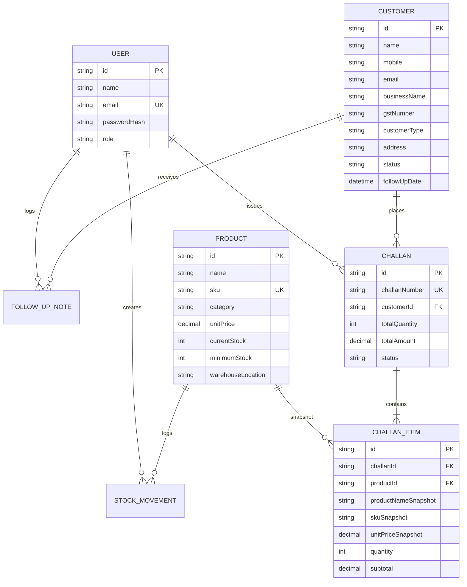

# 🏬 Mini ERP + CRM Operations Portal

A production-ready **Mini ERP + CRM Operations Portal** built for B2B distributors, wholesalers, and sales operations teams. The portal unifies customer relationship management (CRM), catalog inventory tracking, stock movements, and sales challan creation with strict inventory rules and role-based access control.

---

## 🌟 Core Features

- **🔒 Authentication & RBAC**: Signed JWT session tokens with strict role-based authorization (`ADMIN`, `SALES`, `WAREHOUSE`, `ACCOUNTS`).
- **👥 Customer CRM**: Lead lifecycle management (`LEAD`, `ACTIVE`, `INACTIVE`), customer types (`RETAIL`, `WHOLESALE`, `DISTRIBUTOR`), GSTIN tracking, and interaction follow-up notes.
- **📦 Inventory & Catalog**: Real-time product inventory, low-stock threshold triggers (`currentStock <= minimumStock`), and SKU tracking.
- **🔄 Immutable Stock Audit Logs**: Full audit trail of stock additions (`IN`) and deductions (`OUT`) with user attributions.
- **📜 Sales Challans Engine**:
  - Auto-generated sequential challan numbers (`SCH-YYYY-0001`).
  - Item snapshot preservation (`productNameSnapshot`, `skuSnapshot`, `unitPriceSnapshot`).
  - **Draft Mode**: Reserve order drafts without affecting physical inventory.
  - **Confirmed Mode**: Atomic stock deduction inside database transactions (`prisma.$transaction`). Rejects entire order if any product stock is insufficient.
  - **Non-Negative Stock Guarantee**: Ensures physical inventory levels can never drop below zero.

---

## 🛠️ Technology Stack

| Layer | Technology |
| :--- | :--- |
| **Backend Runtime** | Node.js (v18+) with TypeScript |
| **HTTP Framework** | Express.js |
| **ORM / Database Layer** | Prisma ORM v5.22 |
| **Database** | SQLite (Zero-config local) / PostgreSQL |
| **Validation** | Zod Schema Validation |
| **Security** | JWT (`jsonwebtoken`) & password hashing (`bcryptjs`) |
| **Frontend Framework** | React 18 with TypeScript & Vite |
| **Styling** | Vanilla CSS & Tailwind CSS |
| **API Client** | Axios with request/response interceptors |
| **Icons** | Lucide React |

---

## 📂 Repository Folder Structure

```
Full_Stack_Devloper_Case_Study/
├── postman_collection.json    # Complete Postman API Test Collection
├── README.md                  # Project Documentation
├── server/                    # Express Backend Package
│   ├── prisma/
│   │   ├── schema.prisma      # Prisma Database Schema
│   │   ├── seed.ts            # Database Seeding Script
│   │   └── dev.db             # Local SQLite Database File
│   ├── src/
│   │   ├── config/            # Environment & DB Config (env.ts, db.ts)
│   │   ├── controllers/       # Route Controllers (auth, customer, product, inventory, challan, report)
│   │   ├── middlewares/       # Auth (JWT, RBAC), Zod Validation & Global Error Handler
│   │   ├── routes/            # Express Route Definitions
│   │   ├── schemas/           # Zod Input Validation Schemas
│   │   ├── test-integration.ts # Automated 26-Point Integration Test Suite
│   │   └── index.ts           # Server Application Entrypoint
│   ├── package.json
│   └── tsconfig.json
└── client/                    # Vite + React Frontend Package
    ├── src/
    │   ├── api/               # Axios Client Setup (axios.client.ts)
    │   ├── components/        # Layout, Navbar, Sidebar, ConfirmModal
    │   ├── context/           # AuthContext (JWT persistence & RBAC helpers)
    │   ├── pages/             # Dashboard, Customers, Products, Stock Movements, Challans
    │   ├── types/             # Shared TypeScript Interfaces & Types
    │   ├── App.tsx            # App Router & Protected Routes
    │   └── main.tsx           # React DOM Entrypoint
    ├── package.json
    └── vite.config.ts
```

---

## 🗄️ Database Schema Overview



---

## 🔐 Credentials & Role Test Matrix

The local database seed script initializes test credentials for all 4 system roles (password for all demo accounts: `password123`):

| Role | Email | Password | Module Access Permissions |
| :--- | :--- | :--- | :--- |
| **`ADMIN`** | `admin@company.com` | `password123` | Full access to all modules (CRM, Inventory, Audit Logs, Challans). |
| **`SALES`** | `sales@company.com` | `password123` | Customer CRM, Product view, Create Challans (Draft/Confirm), Log Follow-ups. |
| **`WAREHOUSE`** | `warehouse@company.com` | `password123` | Product catalog management, Manual stock adjustments (`IN`/`OUT`), Audit logs. |
| **`ACCOUNTS`** | `accounts@company.com` | `password123` | View Customers, Products, Challans, Status transition (Draft/Confirm/Cancel). |

---

## ⚙️ Environment Variables

### Backend (`server/.env`)
```env
PORT=5000
DATABASE_URL="file:./dev.db"
JWT_SECRET="mini_erp_crm_super_secret_jwt_key_2026"
NODE_ENV="development"
```

### Frontend (`client/.env`)
```env
VITE_API_BASE_URL="http://localhost:5000"
```

> [!NOTE]
> No production secret keys or credentials are contained in the codebase. Development defaults are provided above for local execution.

---

## 🚀 Quickstart & Local Setup

### Prerequisites
- Node.js (v18.0.0 or higher)
- npm (v9.0.0 or higher)

### 1. Backend Setup & Startup
```bash
# Navigate to server directory
cd server

# Install dependencies
npm install

# Push database schema & generate Prisma client
npx prisma db push

# Seed demo users, customers, and products
npx ts-node prisma/seed.ts

# Start backend development server (Port 5000)
npm run dev
```

### 2. Automated Integration Verification Suite
To run the automated **26-point business logic verification test suite**:
```bash
cd server
npx ts-node src/test-integration.ts
```

### 3. Frontend Setup & Startup
```bash
# Navigate to client directory
cd ../client

# Install dependencies
npm install

# Start Vite development server (Port 5173)
npm run dev
```

Open your browser at `http://localhost:5173` and log in with any test user credentials.

---

## 📖 Sales Challan & Stock Engine Business Rules

1. **Snapshot Preservation**: When an order item is added to a sales challan, `productNameSnapshot`, `skuSnapshot`, and `unitPriceSnapshot` are frozen on the `ChallanItem` model. Historical challan records remain untouched even if product prices or names change in the future.
2. **Draft State Behavior**: Creating or editing a `DRAFT` sales challan does **NOT** modify product stock levels.
3. **Confirmed State Behavior**:
   - Transitioning an order to `CONFIRMED` executes a single atomic transaction (`prisma.$transaction`).
   - The engine checks stock availability for **ALL** line items.
   - If **ANY** item has insufficient stock, the transaction aborts with an HTTP 400 Bad Request error, preventing partial stock updates or negative inventory.
   - When confirmed, stock is decremented and `OUT` stock movements are recorded.
4. **Cancelled State Behavior**: Cancelling a confirmed sales challan restores product stock levels (`IN` stock movement) and marks the challan as `CANCELLED`.

---

## 📬 Postman API Collection Usage

A pre-built Postman collection [`postman_collection.json`](file:///c:/Users/SACHIN/OneDrive/Desktop/Full_Stack_Devloper_Case_Study/postman_collection.json) is available in the root directory.

### Quick Postman Setup:
1. Open Postman -> Click **Import** -> Select `postman_collection.json`.
2. Execute **`POST Login (Admin)`**.
3. Copy the returned JWT token value from response `token`.
4. Set collection environment variable `authToken` to the JWT token.
5. All endpoints (`Customers`, `Products`, `Inventory`, `Challans`) will automatically authenticate.

---

## 🌐 API Endpoint Reference

| Method | Endpoint | Description | Required Roles |
| :--- | :--- | :--- | :--- |
| `POST` | `/auth/login` | Login & receive signed JWT | Public |
| `GET` | `/auth/me` | Fetch active user session profile | Authenticated |
| `GET` | `/customers` | List customers (search, type & status filters) | ADMIN, SALES, ACCOUNTS |
| `POST` | `/customers` | Create customer profile | ADMIN, SALES |
| `GET` | `/customers/:id` | Get customer profile & follow-ups | ADMIN, SALES, ACCOUNTS |
| `PUT` | `/customers/:id` | Update customer record | ADMIN, SALES |
| `POST` | `/customers/:id/follow-ups` | Log interaction follow-up note | ADMIN, SALES |
| `GET` | `/products` | List products & low-stock alerts | All Roles |
| `POST` | `/products` | Add new catalog product | ADMIN, WAREHOUSE |
| `GET` | `/products/:id` | View product details | All Roles |
| `PUT` | `/products/:id` | Update product details | ADMIN, WAREHOUSE |
| `GET` | `/inventory/movements` | View stock audit movement log | All Roles |
| `POST` | `/inventory/movements` | Record manual stock adjustment (`IN`/`OUT`) | ADMIN, WAREHOUSE |
| `GET` | `/challans` | List sales challans | All Roles |
| `POST` | `/challans` | Create sales challan (Draft or Confirmed) | ADMIN, SALES |
| `GET` | `/challans/:id` | View printable sales challan details | All Roles |
| `PUT` | `/challans/:id` | Status transition (Confirm or Cancel) | ADMIN, SALES, ACCOUNTS |

---

## 💡 Assumptions & Known Limitations

- **Assumptions**:
  - Currency is standardized in INR (₹).
  - Sequential challan numbers reset per calendar year (`SCH-2026-XXXX`).
- **Known Limitations**:
  - Zero-dependency local setup uses SQLite file database (`dev.db`). For high-concurrency production deployments, switch provider in `schema.prisma` to PostgreSQL by updating `DATABASE_URL`.
